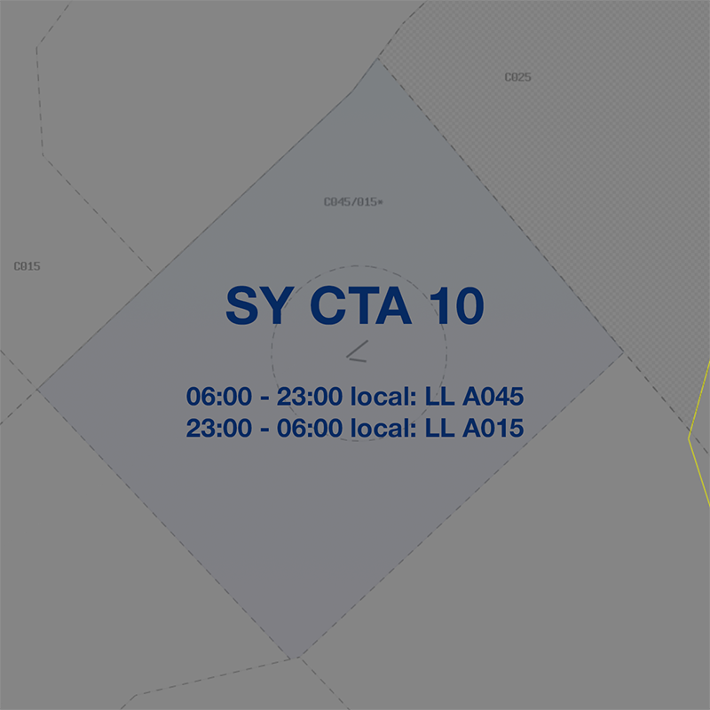
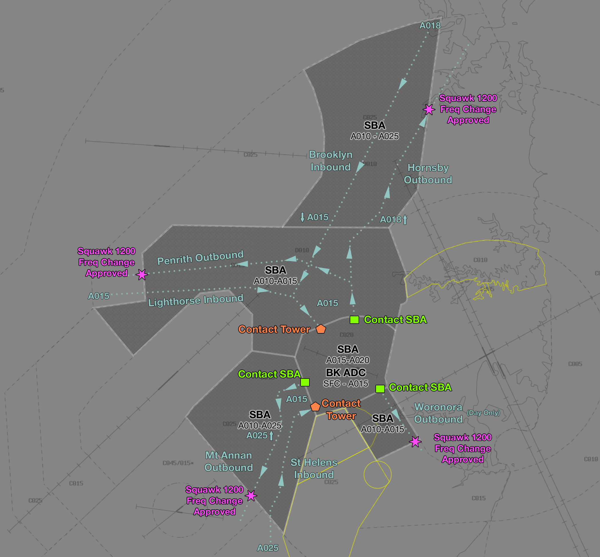

--8<-- "includes/abbreviations.md"

## Airspace
BK ADC is responsible for the Class D airspace in the BK CTR `SFC` to `A015`.

When BK ADC (Circuit) is online, responsibility for the **Runway**, **Circuit**, and **Airspace** is divided between the two ADC controllers.

ADC (Circuit) takes responsibility for the southern Runway, Circuit and Airspace (Runway **11R/29L**) at or below `A010`. ADC North takes responsibility for all other airspace.

The ATIS will indicate the current runway config and nominate what each parallel runway is being used for. 

| Runway | Use |
| ------ | --- |
| Northern Runway (11L/29R) | VFR arrivals/departures |
| Southern Runway (11R/29L) | Circuit training |
| Centre Runway (11C/29C) | IFR arrivals/departures and VFR overflow |

### Tower Closed Procedures
When BK ADC is offline, the airspace reverts to Class G. CTAF procedures apply.

### Sydney CTA C10
The volume of Class C airspace overhead Camden (known as SY CTA C10) has a lower level that varies according to the time of day. During the hours of 23:00 - 06:00 Sydney local time, the airspace within the C10 area is lowered to `A015`.

<figure markdown>
{ width="400" }
  <figcaption>Sydney CTA C10 Airspace</figcaption>
</figure>

The status of the C10 CTA step will be notified on the YSBK ATIS for the awareness of pilots intending to operate in the area.

## Start Approval
Start approval is required on SMC for all aircraft.

!!! phraseology  
    **LKU**: "Bankstown Ground, Warrior LKU, for circuits, received Echo, request engine start"  
    **BK SMC**: "LKU, Bankstown Ground, start approved"  
    **LKU**: "Start approved, LKU"

## Taxiing
The apron areas are outside the manoeuvring area. The runup bays and all connecting taxiways are inside the manoeuvring area, requiring taxi instructions.

!!! tip
    The YSBK Manoeuvring Area chart can be found on the [CASA Website](https://www.casa.gov.au/bankstown-manoeuvring-area-map).

A runway crossing clearance is **not** required when taxiing under the runway undershoots on taxiway B or E.

Aircraft vacating RWY 11C/29C must **hold short** of any adjacent runway and remain on **ADC** frequency, who will issue explicit runway crossing instructions.

## VFR Coded Clearances
Coded clearances are used to provide standardised routing for VFR aircraft departing YSBK, due to the surrounding/overlying Class D airspace. VFR aircraft intending to operate to/from YSBK shall plan via a lane as directed below.

<figure markdown>
{ width="700" }
  <figcaption>Bankstown Coded Clearances</figcaption>
</figure>

Each coded clearance includes tracking instructions and height requirements that ensure aircraft remain within Class D airspace. Each coded clearance also includes explicit instructions on when to change frequencies.

!!! warning "Important"
    Pilots intending to operate in Class D CTA are required to file a flight plan. Ensure your filed route includes the waypoints listed below.

### Departures
VFR aircraft intending to track via a coded clearance require an airways clearance from **BK SMC**.

| Coded Clearance      | Route                   | Altitude | Notes |
| -------------------- | ----------------------- | -------- | ----- |
| Hornsby Outbound     | `PRT CFCR PENH HSY PAA` | `A015` to CFCR, thence `A018` |  |
| Mount Annan Outbound | `HXPR EMPS MAGG`        | `A015` to EMPS, thence `A025` |  |
| Penrith Outbound     | `PRT SITS VCBR`         | `A015`   |       |
| Woronora Outbound    | `REVS CASO WORC`        | `A015`   | Day Only |

!!! phraseology
    **UNY**: "Bankstown Ground, Diamond UNY, taxiway L, received B, for Hornsby Outbound, request taxi"   
    **BK SMC**: "UNY, Bankstown Ground, cleared Hornsby Outbound, taxi to holding point A8 runway 29R"  
    **UNY**: "Cleared Hornsby Outbound, taxi to holding point A8 runway 29R, UNY"  

Aircraft shall report ready to **BK ADC** with their departure intentions. A takeoff clearance constitutes a clearance to operate in accordance with your requested departure. 

!!! phraseology
    **UNY**: "Bankstown Tower, Diamond UNY, holding point A8, runway 29R, for Hornsby Outbound, ready"   
    **BK ADC**: "UNY, Bankstown Tower, runway 29R, cleared for takeoff"  
    **UNY**: "Cleared for takeoff runway 29R, UNY" 

After takeoff, aircraft are expected to comply with the following tracking instructions:

=== "Departure RWY 11"

    | Coded Clearance                       | Tracking       | 
    | ------------------------------------- | --------------------- |
    | Mount Annan Outbound                  | <ul><li>At `A005`, turn left downwind, track to Dunc Gray Velodrome, climb to `A015`.</li><li>At Dunc Gray Velodrome and not before reaching `A015`, track to intersection of Hoxton Park Rd & M7.</li><li>Track via Mount Annan Outbound.</li></ul> |
    | Hornsby Outbound, or Penrith Outbound  | <ul><li>Climb to `A005`, then turn left direct to PRT, climb to `A015`.</li><li>Track via nominated coded clearance.</li></ul> |
    | Woronora Outbound                     | As directed by ATC to REVS |

=== "Departure RWY 29"

    | Coded Clearance                       | Tracking    | 
    | ------------------------------------- | --------------------- |
    | Mount Annan Outbound                  | <ul><li>Climb to `A010`.</li><li>Crossing Hume Highway, track to intersection of Hoxton Park Rd & M7, climb to `A015`.</li><li>Track via Mount Annan Outbound.</li></ul> |
    | Hornsby Outbound, or Penrith Outbound  | <ul><li>Climb to `A005`, then turn right direct to PRT, climb to `A010`.</li><li>Crossing the pipeline (approx 3nm BK), climb to `A015`.</li><li>Track via nominated coded clearance.</li></ul> |
    | Woronora Outbound                     | As directed by ATC to REVS |

Aircraft operating on a coded clearance shall transfer to the next appropriate frequency upon leaving the zone, **no explicit frequency transfer will be given**. 

!!! phraseology
    **UNY**: "Bankstown Approach, Diamond UNY, passing `A011`, climbing to `A015`"   
    **SBA**: "UNY, identified"

!!! warning "Important"
    The Bankstown CTR is bordered to the east and south by the Sydney CTR. All VFR aircraft must depart to the west or northwest unless in receipt of an airways clearance.

### Arrivals
VFR aircraft inbound to YSBK shall contact **SYC on 124.55** prior to entering CTA. SYC may transfer the aircraft to SBA who will issue airways clearance via one of the following routes:

| Coded Clearance    | Route             | Altitude | 
| ------------------ | ------------------- | ------ | 
| Brooklyn Inbound   | `BBG BEE CAST BKHR PSP` | `A018` to BEE, thence `A015` by BKHR  |
| Lighthorse Inbound | `NPBR LIHR PSP`     | `A015`   |
| St Helens Inbound  | `SSKP CRST CRSC`    | `A025` to CRST, thence `A015` by CRSC   |

Establishing two-way communication with ATC constitutes a clearance to enter CTA as requested (other than an instruction to standby or similar).

!!! phraseology
    **BJZ**: "Sydney Centre, BJZ, Seminole, 5nm north of BBG, `A015`, received B, for Brooklyn Inbound"   
    **SYC**: "BJZ, Sydney Centre, squawk 0552, remain outside Class D airspace"  
    **BJZ**: "Squawk 0552, remain outside Class D airspace, BJZ"  

    **SYC**: "BJZ, identified, contact Bankstown Approach 125.8"  
    **BJZ**: "125.8, BJZ"  
    ...  
    **BJZ**: "Bankstown Approach, BJZ, 2nm north of BBG, `A015`, received B, for Brooklyn Inbound"  
    **SBA**: "BJZ, Bankstown Approach, cleared Brooklyn Inbound"  
    **BJZ**: "Cleared Brooklyn Inbound, BJZ"  

Each coded clearance includes a frequency transfer instruction to BK ADC, **no explicit frequency transfer will be given**.

When transferring to BK ADC, pilots should expect the following circuit instructions:

| VFR Approach Point | RWY 29  | RWY 11 |
| ----------------| --------- | ---------- |
| PSP    | *"Join right downwind runway 29R, maintain `A015`"*, then when abeam the runway 11 thresholds or clear of departing traffic, *"Cleared visual approach"*       | *"Join final runway 11L, report 3nm"*        |
| CRSC   | *"Join crosswind runway 29R, maintain `A015`"*, then when abeam the runway 11 thresholds or clear of departing traffic, *"Cleared visual approach"* | *"Join final runway 11L, report at Warwick Farm"*  |

Warwick Farm is the large racecourse approx. 2nm west of YSBK on the Georges River.

!!! note
    Aircraft joining final in the RWY 11 direction are not assigned a level and are expected to commence a visual approach in accordance with the tracking instructions issued by ADC.

!!! phraseology  
    **TEK**: "Bankstown Tower, Warrior TEK, CRSC, `A010`, inbound, received Golf"  
    **BK ADC**: "TEK, Bankstown Tower, join final runway 11L, report at Warwick Farm"  
    **TEK**: "Join final runway 11L, TEK"  

    **BK ADC**: "TEK, RWY 11L, cleared to land"  
    **TEK**: "RWY 11L, cleared to land, TEK"

### Class D Transits
Aircraft intending to transit the Sydney TMA should plan to remain OCTA where possible. The [Victor One](../Class%20C/sydney.md#victor-one) lane is a suitable option for aircraft track north or south which does not require an airways clearance. Otherwise, the [Richmond Lane of Entry](../Class%20C/richmond.md#richmond-lane-of-entry) is another option to the west, which requires a clearance from BK ADC (when online).

Alternatively, aircraft may utilise the YSBK coded clearances to track towards YSBK and then continue on another clearance outbound. These aircraft must make their requests to **SYC** early and expect a clearance tracking inbound on a coded clearance, then tracking via an outbound clearance, passing through the top of the BK CTR at `A015`.

## Circuits
All circuits are to be flown at `A010`.

| Runway | Day  | Night |
| ----------------| --------- | ---------- |
| RWY 11L    | Left       | -        |
| RWY 11C   | Left | Right  |
| RWY 11R    | Right | -  |
| RWY 29L     | Left        | -  |
| RWY 29C    | Right | Left         |
| RWY 29R    | Right        | -  |

## Helicopter Operations
### General
These procedures apply during hours of daylight only. During hours of darkness, all helicopters must revert to fixed-wing operations.  

The Main Pad (abeam taxiway Mike) is treated like a runway and requires a takeoff/landing clearance. Helicopters are permitted to become airborne from a limited number of other locations on the aerodrome, such as taxiway November Two, and will be instructed to *"report airborne"* or *"report on the ground"*.

### Reporting Points
Three helicopter reporting points help keep helicopters segregated from other traffic.  

- **CWST**: Michels Patisserie located 1.2nm west of CNTH on the water pipeline  
- **CNTH**: Northern end of Regents Park Railway Station, roughly 300 metres north of the water pipeline  
- **CSTH**: Intersection of two creeks enclosing a sewage treatment works 2.1nm south of the aerodrome reference point

### Inbound Procedures
Helicopters should track inbound to the BK CTR as per below:

- Via a coded clearance or inbound reporting point (PSP or CRSC), or
- From R407, tracking RYB-CWST/CNTH (depending on runway mode) at `A007`

Pilots must report to **BK ADC** prior to entering the BK CTR and expect tracking instructions as per below:

| Inbound Point | RWY 11 | RWY 29 |
| ----------------| --------- | ---------- |
| PSP | *"Report CWST"*, then  *"Join base main pad"* | *"Report CNTH"*, then  *"Join base main pad"* |
| CRSC | *"Report CSTH, `A005`"*, then  *"Overfly midfield at `A005`, join downwind main pad"* | *"Report CSTH, `A005`"*, then  *"Overfly midfield at `A005`, join downwind main pad"* |
| RYB | *"Report CWST"*, then  *"Join base main pad"* | *"Report CNTH"*, then  *"Join base main pad"* |

!!! note
    Helicopters tracking via CSTH will pass over the runway complex midfield at `A005` to join downwind. Traffic information will be provided on aircraft operating to the runways below.

### Outbound Procedures
Helicopters should track outbound from the BK CTR as per below:

- Via a coded clearance, or
- To R407, tracking CWST/CNTH-RYB (depending on runway mode) at `A007`

Departures to the north must track via CWST when RWY 29s are in use and CNTH when RWY 11s are in use.

Helicopters shall report ready to **BK ADC** with their departure intentions. In response, **BK ADC** will clear the aircraft for takeoff and instruct them to track via the appropriate exit gate.

!!! phraseology
    **YZD:** "Bankstown Tower, helicopter YZD, main pad, for Choppers North departure, ready"  
    **BK ADC:** "YZD, Bankstown Tower, depart Choppers North, main pad, cleared for takeoff"

!!! note
    Helicopters tracking via the Mt Annan Outbound will pass over the runway complex midfield at `A005` to join downwind. Traffic information will be provided on aircraft operating to the runways below.

### Circuits
Circuits are conducted within the lateral confines of the fixed-wing circuit at `A007`, in the same direction as the current runway config. The termination point of the circuit is the Main Pad.

!!! phraseology
    **BK ADC:** "SUA, main pad, cleared stop and go"

## IFR Operations
IFR aircraft should request airways clearance from **BK SMC** with their taxi request.

IFR aircraft shall expect the **MECKO** or **URDOS** SIDs, depending on direction of travel. Aircraft unable to accept a procedural SID must notify SMC on first contact.

!!! phraseology
    **FD213**: "Bankstown Ground, FD213, taxiway Charlie, for Dubbo, received Echo, request taxi and airways clearance"  
    **BK SMC**: "FD213, Bankstown Ground, cleared to Dubbo via BENBU, flight planned route, URDOS1 departure, climb via SID to `A030`, squawk 3244, taxi via A8, hold short RWY 29R"  
    **FD213**: "Cleared to Dubbo via BENBU, flight planned route, URDOS1 departure, climb via SID to `A030`, squawk 3244, taxi via A8, hold short RWY 29R, FD213"

A single STAR exists to process aircraft inbound from the east, terminating in vectors. RNP approaches are available to RWY 11C from the west and southwest. An RNP approach is available to the circling area from the north.

!!! note
    Delays may be experienced for IFR arrivals to YSBK during periods of high traffic levels at YSWS or YSSY.

IFR aircraft may be instructed to track to/from YSBK via a [VFR coded clearance](#vfr-coded-clearances) by day VMC.