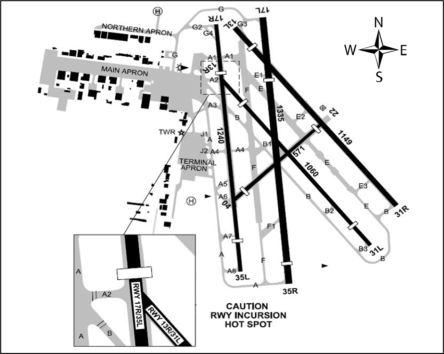

--8<-- "includes/abbreviations.md"

## Aerodromes
|**Name**        |**Airspace**        |**ICAO**            |
|-----------|---------------|---------------|
| Melbourne Airport | Class C | YMML |
| Essendon | Class C | YMEN |
| Avalon | Class D | YMAV |
| Moorabbin | Class D | YMMB |

## Melbourne Airport
Melbourne (Tullemarine) Airport is the second busiest aerodrome in Australia. Melbourne runs 

## Avalon Airport

## Moorabbin Airport
Moorabbin Aiport is a Class Delta airspace. The aerodrome is the busiest training airport in Australia, therefore it's local procedures are very pilot dependent, and rely on pilots following local inbound and outbound procedures to maintain smooth operation. 

### Dual Runway Ops

Moorabbin usually runs dual runway operations, having 5 runways at their disposal. Due to this, one runway will normally be used for Circuit operations, that being the Eastern runway, while the Western runway will usually be used for arriving and departing traffic, however, both runways can and often are used for arriving and departing traffic, if traffic permits.

### Ground Procedures
On the ground, aircraft in the apron bays may start up and taxi their aircraft without having to recieve a start or taxi clearance. Aircraft will then follow taxiways to the Northern or Southern runup bays.
Once runups are complete, an aircraft can call for taxi to either runway in use, as well as stating the following call, including, who you are, what aircraft you are in, where you are, where you want to taxi to and how you want to depart (usually via a leg of a circuit, or via a known waypoint.)

YOU: `Moorabbin Ground, VCY, Cessna 152, Southern Runup bay, request taxi runway 17R, upwind departure to the training area, in receipt of Uniform.`

MB_GND: `VCY, ground, taxi holding point Golf 2 runway 17R` 

Although at first slightly daunting, Moorabbin's taxiways can be easily learned, and as the saying goes, if you can taxi at Moorabbin, you can taxi anywhere.

### Outbound
Departing Moorabbin, you will always depart initially via a leg of the circuit, wether that be upwind, crosswind or downwind. Aircraft departing Moorabin should maintain 2000 feet unless otherwise advised, until outside the 3 mile zone, where aircraft may then fly underneath the Class Charlie airspace (northbound bellow 3,500 FT, Southbound bellow 4,500 FT.)

## Essendon Airport

## to do list. (remove later)
- city orbits OK!
- sunbury corridor
- bay VFR route
- visual STARs to YMML
- YMEN tower closed procedures