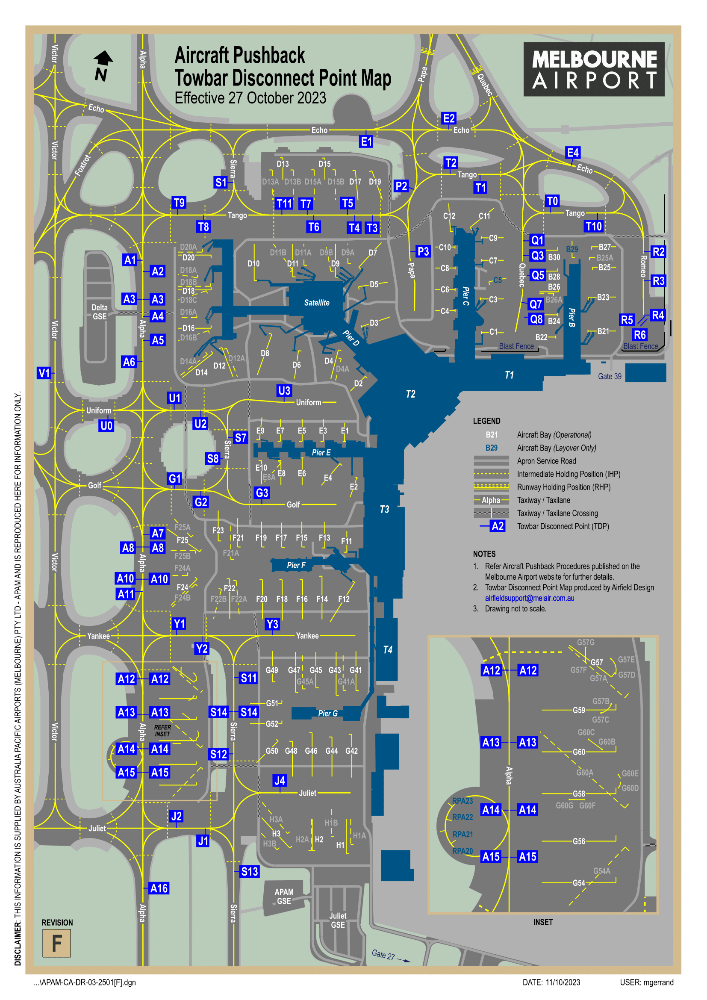
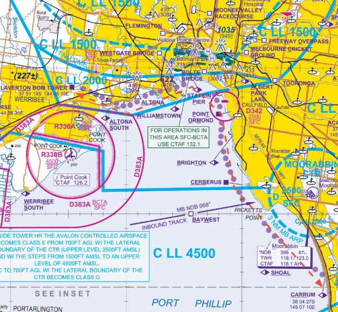

--8<-- "includes/abbreviations.md"

## Aerodromes
|**Name**        |**Airspace**        |**ICAO**            |
|-----------|---------------|---------------|
| Melbourne Airport | Class C | YMML |
| Essendon | Class C | YMEN |
| Avalon | Class D | YMAV |
| Moorabbin | Class D | YMMB |

## Melbourne Airport
### On the ground

Melbourne Airport runs 2 runways, that being runway 16/34, and runway 27/09.

### Pushback

Melbourne airport uses **disconnect points** procedures to pushback aircraft. The system is comprised of multiple points on the ground of which ATC can direct aircraft to pushback to. This system is used to optimise the flow of traffic pushing back, allowing for a more efficient flow of traffic to both enter and exit the bays.

ATC will usually assign a disconnect point;

**QFA728:** `Ground g'day, QFA728 in reciept of November, stand Charlie 11, request push.`

**ATC:** `QFA728 ground, push approved, disconnect Tango 10.`

**QFA728:** `Push approved, disconnect Tango 10, QFA728`

Pilots can also request to use specific disconnect points;

**JST416:** `Ground g'day, JST416 in reciept of Oscar, stand Foxtrot 16, request push, disconnect Sierra 14.`

**ATC:** `JST416, ground, push approved, disconnect Sierra 14`

**JST416:** `Push approved, disconnect Sierra 14, JST416.`

### Taxi

Melbourne utilises standard taxi routes, that being outbounds on Alpha and Echo, and inbounds on Victor and Tango.

## Avalon Airport

## Moorabbin Airport
Moorabbin Aiport is a Class Delta airspace. The aerodrome is the busiest training airport in Australia, therefore it's local procedures are very pilot dependent, and rely on pilots following local inbound and outbound procedures to maintain smooth operation. 

### Dual Runway Ops

Moorabbin usually runs dual runway operations, having 5 runways at their disposal. Due to this, one runway will normally be used for Circuit operations, that being the Eastern runway, while the Western runway will usually be used for arriving and departing traffic, however, both runways can and often are used for arriving and departing traffic, if traffic permits.

### Ground Procedures
On the ground, aircraft in the apron bays may start up and taxi their aircraft without having to recieve a start or taxi clearance. Aircraft will then follow taxiways to the Northern or Southern runup bays.
Once runups are complete, an aircraft can call for taxi to either runway in use, as well as stating the following call, including, who you are, what aircraft you are in, where you are, where you want to taxi to and how you want to depart (usually via a leg of a circuit, or via a known waypoint.) 

YOU: `Moorabbin Ground, VCY, Cessna 152, Southern Runup bay, request taxi runway 17R, upwind departure to the training area, in receipt of Uniform.`

MB_GND: `VCY, ground, taxi holding point Golf 2 runway 17R` 

Although at first slightly daunting, Moorabbin's taxiways can be easily learned, and as the saying goes, if you can taxi at Moorabbin, you can taxi anywhere. 

### Outbound
Departing Moorabbin, you will always depart initially via a leg of the circuit, wether that be upwind, crosswind or downwind. Aircraft departing Moorabin should maintain 2000 feet unless otherwise advised, until outside the 3 mile zone, where aircraft may then fly underneath the Class Charlie airspace (northbound bellow 3,500 FT, Southbound bellow 4,500 FT.) 

Any aircraft that wishes to depart via a known waypoint, must still depart via a circuit leg towards the location, wether that be an upwind towards Carrum (CARR), or a downwind towards Brighton (BTO.) 

### Inbound
To enter the Moorabbin class Delta, Aircraft must call Moorabbin tower via one of the inbound waypoints. These include, Carrum, GMH, Academy, Brighton and Baywest.

Aircraft must be at a mandatory 1,500 FT overhead these waypoints, and proceed with the inbound call, stating, like the taxi call, who they are, what they are, where they are, their altitude, their intentions, and their receipt of the current ATIS. The tower controller will then issue a circuit joining instruction, allowing you into the Class Delta. 

YOU: `Moorabbin Tower, VCY, Cessna 152, Overhead Carrum, 1500, Inbound, with Victor.`

MB_TWR: `VCY, Join downwind, runway 17L`

YOU: `Join downwind, runway 17L, VCY`

If the aerodrome or circuit is too busy, the tower controller may issue the statement to remain outside of the Class Delta airspace, which in that case, you will need to turn around and try again later, or try a different inbound point for a different runway.

YOU: `Moorabbin Tower, VCY, Cessna 152, Overhead Carrum, 1500, Inbound, with Victor.`

MB_TWR: `VCY, the circuit is currently full, remain outside Class Delta airspace`

YOU: `Remain outside Class Delta, VCY`

## Essendon Airport

## VFR Procedures
### Melbourne Coastal Route
The coastal VFR route is used to skirt the Melbourne CTR, south of the city. Aircraft using the route
must remain outside controlled airspace. Pilots should consult the Melbourne (VTC) before flying
the coastal route.

When using the coastal route between Point Ormond and Laverton BOM tower (cloud permitting),
fly westbound at 2,000 ft and eastbound at 1,500 ft.

When using the coastal route between Point Ormond and Carrum (cloud permitting), fly
southbound at 1,500 ft and northbound at 2,500 ft, and track clear of MB CTR.

Keep to the right of the lane to avoid oncoming traffic. Pilots should have landing lights,
anti‑collision strobes and navigation lights on to assist sighting and avoiding other traffic. Maintain
a vigilant lookout and an effective scan. 

### Melbourne City Orbits
VFR aircrft have the ability to orbit the Melbourne CBD. To do so however, they do need to enter controlled airspace. Although Essendon tower owns the Melbourne city airspace, due to the infrequent staffing of EN_TWR on VATSIM, the airspace is normally assumed to Melbourne Approach.

To be cleared to perform a city orbit, aircraft must provide the relevant controller with the following information, including who you are, what you are, where you are, your altitude, and what you intend to do.

YOU: `Melbourne Approach, VCY, Cessna 152, Overhead Point Ormond, 2,000, request one left hand city orbit.`

ATC: `VCY, squawk 8624, cleared one left hand city orbit, not above 1,500, report complete.`

YOU: `Cleared one left hand city orbit, not above 1,500, wilco, VCY`

Once the aircraft is cleared, the aircraft may enter the controlled airspace, and perform an orbit around the outside of Melbourne City. Once the aircraft has completed the orbit, they may notify the ATC of their completion.

YOU: `VCY, Orbit complete, tracking direct Brighton.`

ATC: `VCY, Control services terminated.`

YOU: `Control services terminated, VCY.`

## to do list. (remove later)
- sunbury corridor
- visual STARs to YMML
- YMEN tower closed procedures